# Dynamics

We can build dynamical models of robotic manipulators that consider forces and torques acting on the robot, and model gravity and motion of bodies with mass and inertia. Those models can help us to contol manipulators. For example, we can simulate behaviour of our manipulator and find required input torques to perform the desired motion. 

In order to model our robot, we can use one of the two methods:

## Euler-Lagrange

Here is a brief description of the method:

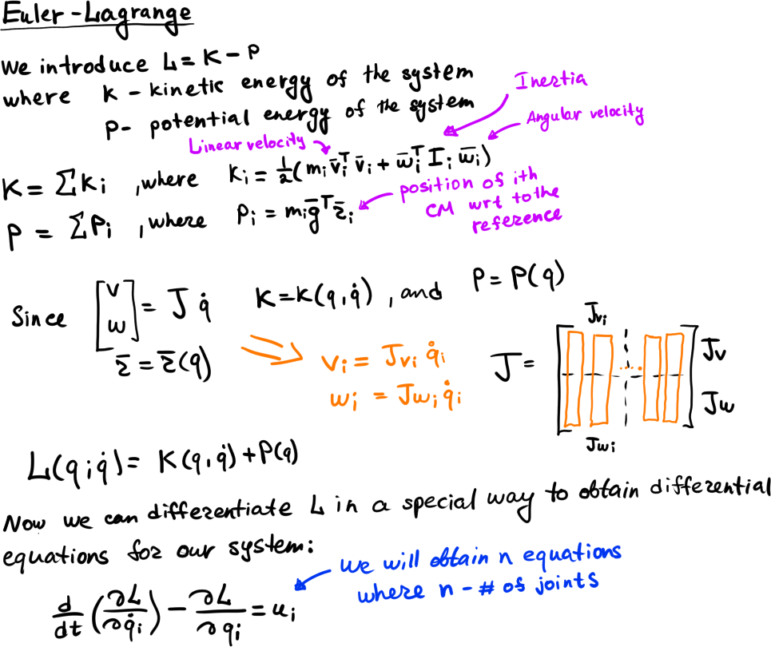

## Newton-Euler

Here is a brief description of the method:

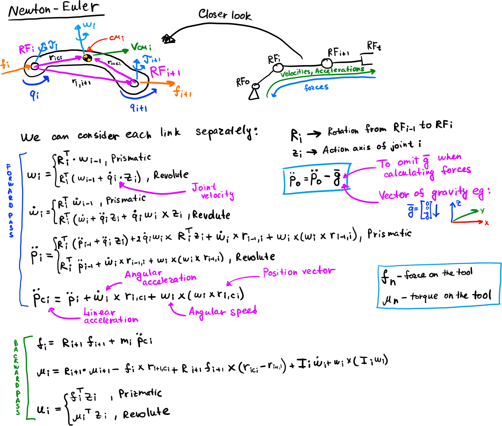

## RR Robot model

RR Robot Dynamic model:

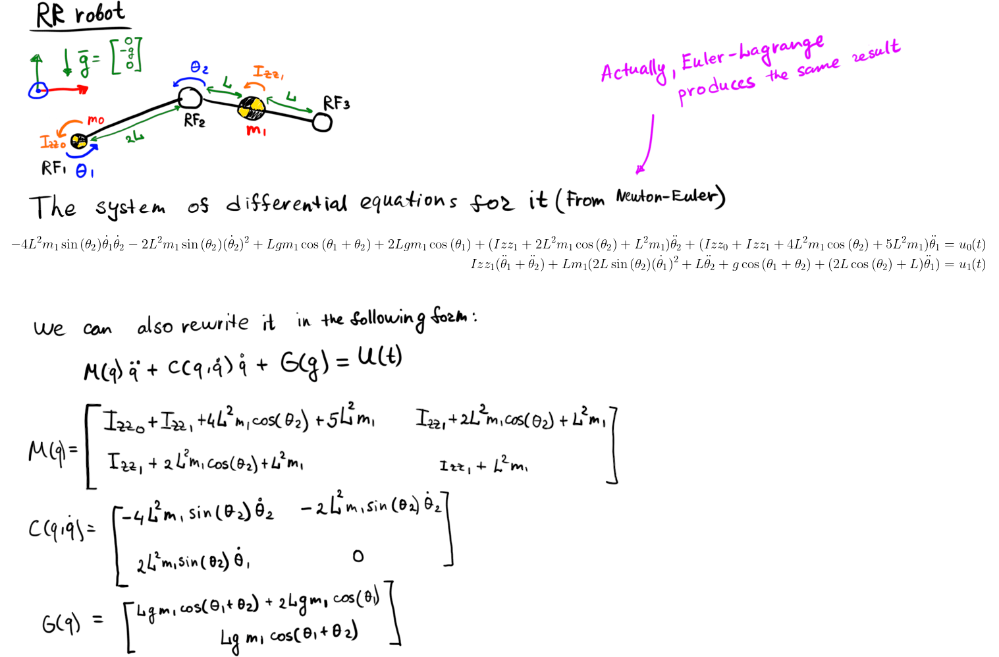

## RR Robot model simulation

Since we know the differential equation for the RR manipulator, we can simulate RR Robot now. Here is the result of simulation with zero input torques and forces and gravity force:

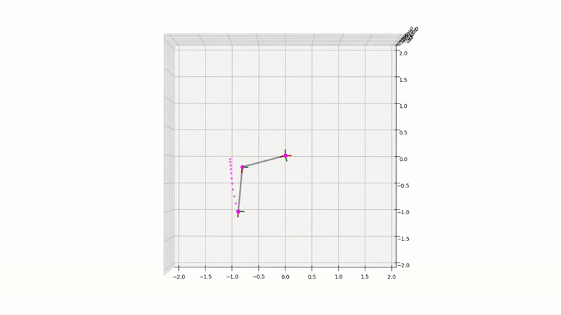

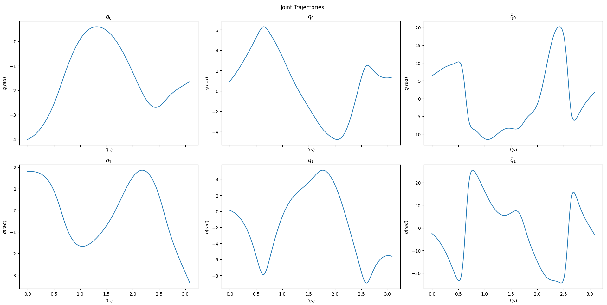

## Desired trajectory following

Now we want the manipulator to follow the desired trajectory. First of all, we need to generate it. In order to do that, we firstly create the trajectory in the Cartesian space, and then transform it to the Joint space afterwards. Here is an example of the trajectory following task:

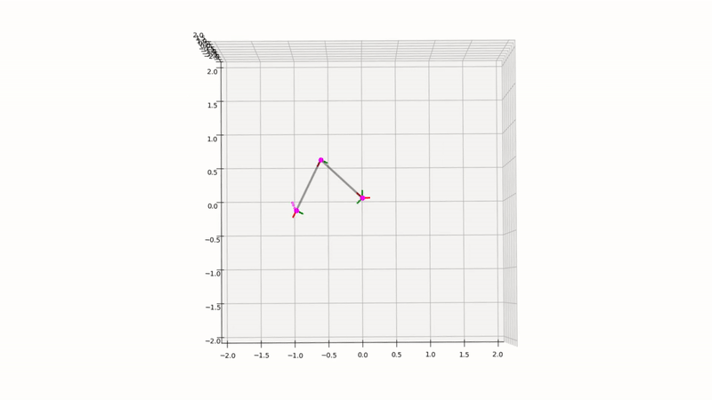

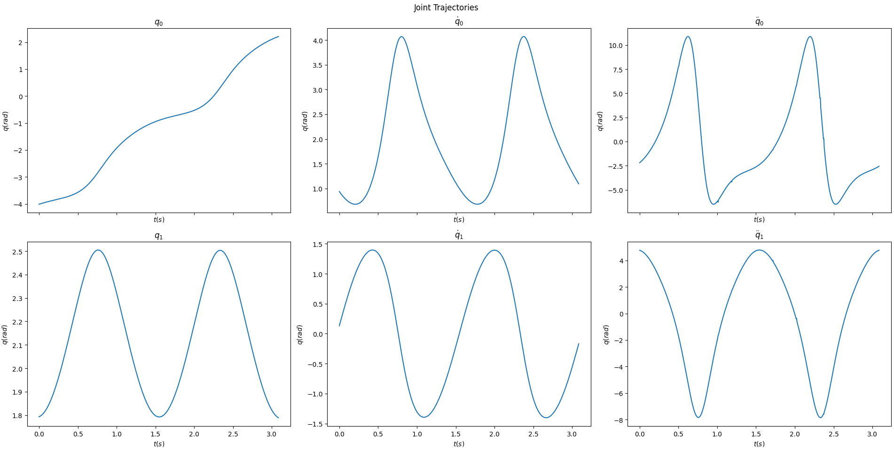

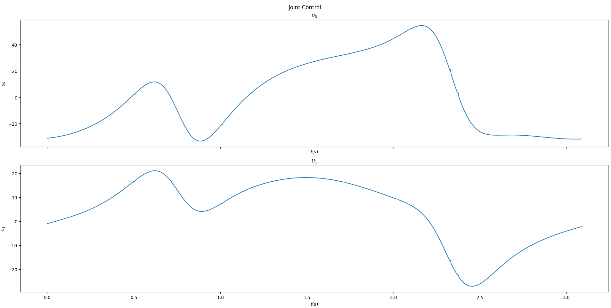

And here is the result of more complicated trajectory following task:

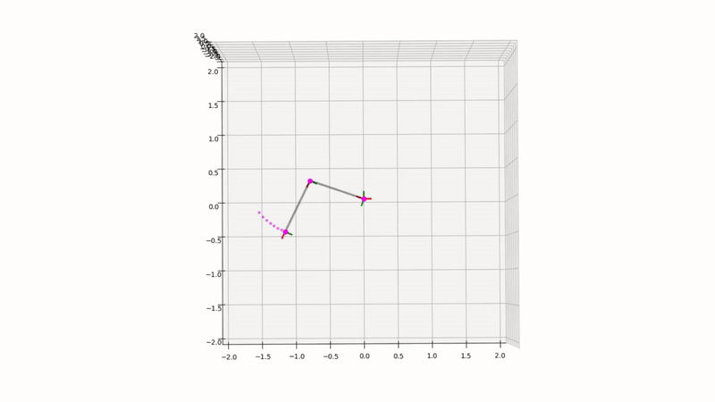

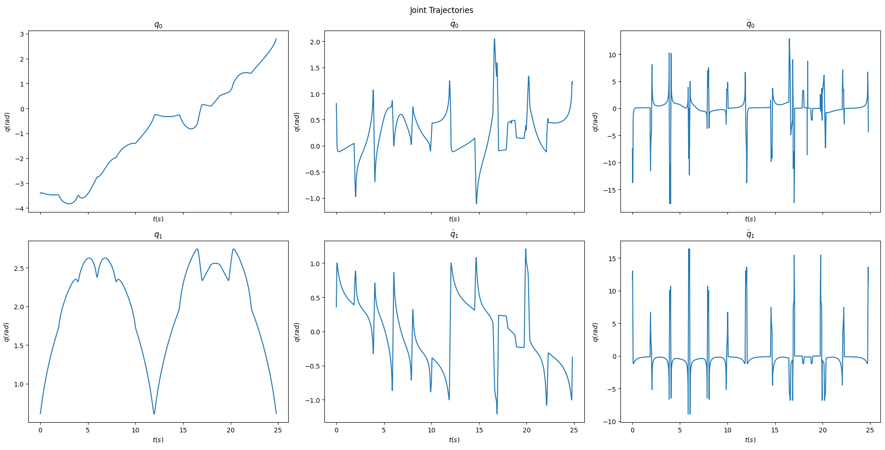

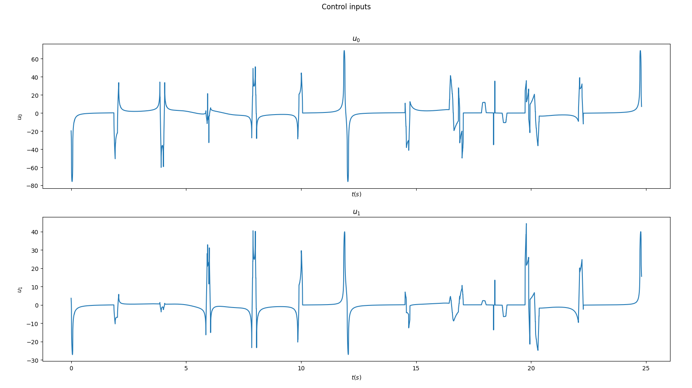

