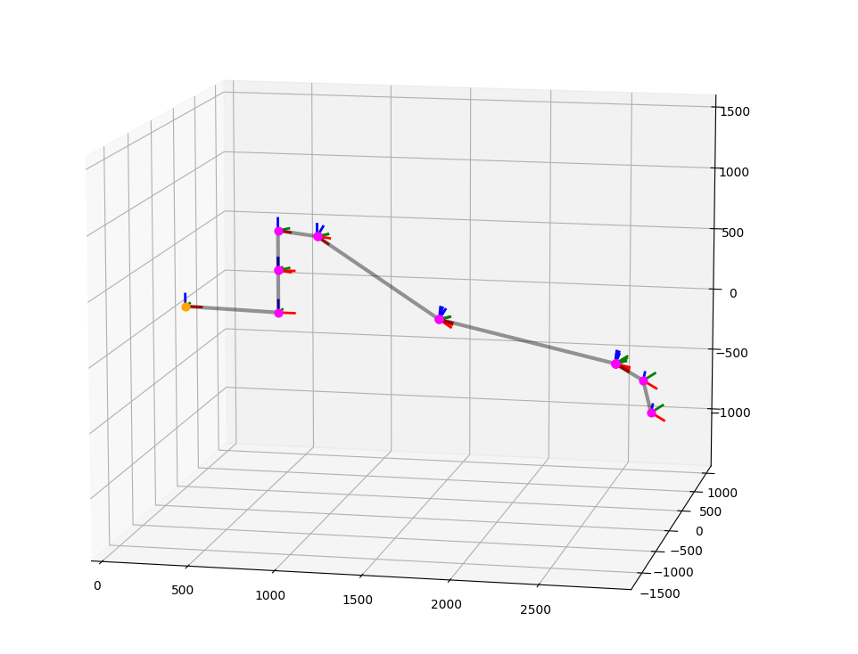
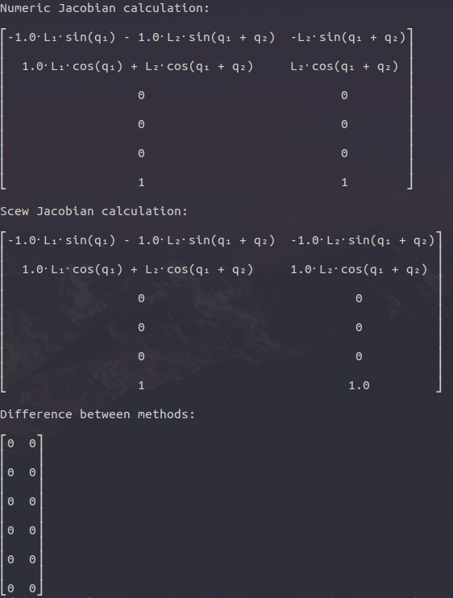
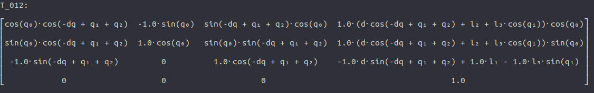
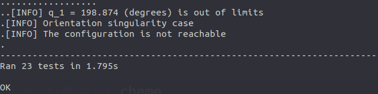

# Kinematics Calculation
Calculation of Forward Kinematics (FK) and Inverse Kinematics (IK) for robotic manipulators

## Repo contents

* `robots` - Folder with IK and FK solutions. Solution descriptions are in `.md` files
* `utils` - Several useful utils like `SymbolicTransformation` that can help with matrix multiplication and other Robotics-related stuff 
* `tests` - Unit tests

## How to run

Here are several useful commands to run:

### Fanuc Kinematics

`python fanuc_kinematics.py`

If you want to see how to use Fanuc165F forward and inverse kinematics calculation.
Check out `robots/FANUC165F.md` for the solution description:

### Fanuc Jacobians

`python fanuc_jacobians.py`

If you want to see how to calculate Fanuc165F Jacobian matrix using Scew theory and numerical matrix differentiation methods. The singularity analysis is also presented.
Check out `FanucJacobians.md` for the solution description:

### Jacobian Calculation

`python jacobian_calculation.py`

If you want to see how to use the `JacobianCalculator` class:

### Symbolic Transformations

`python symbolic_calculation.py`

If you want to see how to use the `SymbolicTransformation` class:

### Unit Tests

`python -m unittest discover`

If you want to run all unit tests:

