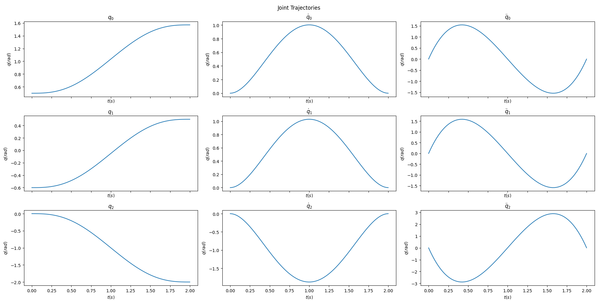
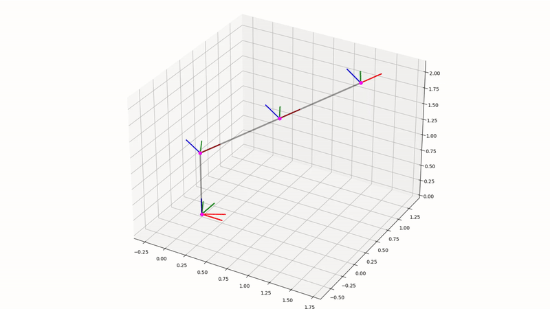
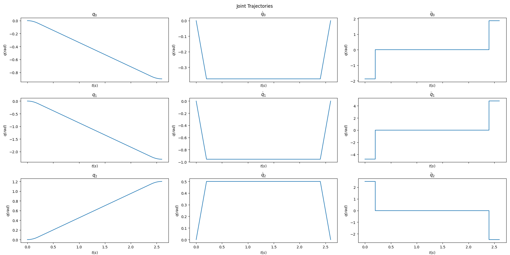
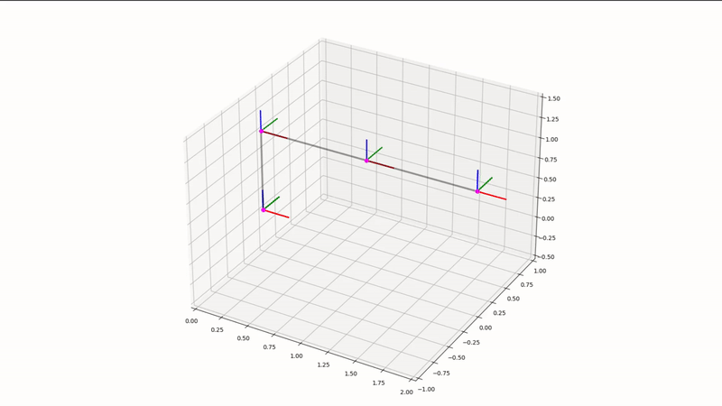
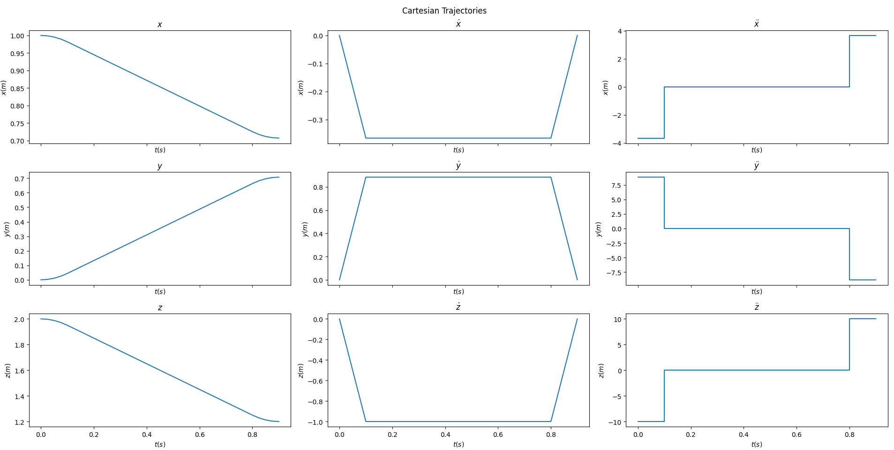
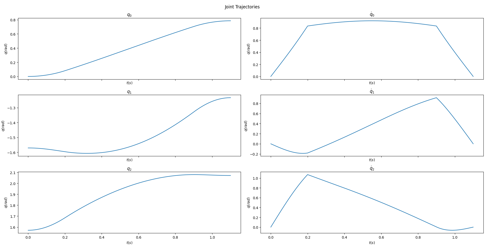

# Robotic manipulators
Calculation of Forward Kinematics (FK), Inverse Kinematics (IK), Jacobians, and trajectory generation for robotic manipulators.

## Repo contents

* `robots` - Folder with IK and FK solutions. Solution descriptions are in `.md` files
* `utils` - Several useful utils like `SymbolicTransformation` that can help with matrix multiplication and other Robotics-related stuff 
* `tests` - Unit tests

## How to run

Here are several useful commands to run:

### Fanuc Kinematics

`python fanuc_kinematics.py`

If you want to see how to use Fanuc165F forward and inverse kinematics calculation.
Check out `robots/FANUC165F.md` for the solution description:

### Fanuc Jacobians

`python fanuc_jacobians.py`

If you want to see how to calculate Fanuc165F Jacobian matrix using Scew theory and numerical matrix differentiation methods. The singularity analysis is also presented.
Check out `FanucJacobians.md` for the solution description:

### RRR Robot trajectory planning

`python rrr_robot_planning.py`

If you want to see how to perform XYZ Polynomial and Trapezoidal trajectory planning for RRR Robot in Joint and Cartesian Space. Check out `TrajectoryPlanning.md` to see how the planning is done.

## Polynomial profile

Sample polynomial trajectory: 

Here is how the manipulator will move:

## Trapezoidal profile (Joint Space)

Sample trapezoidal trajectory in joint space: 

Here is how the manipulator will move:

## Trapezoidal profile (Cartesian Space)

Sample trapezoidal trajectory in cartesian space: 

Their corresponding joint space plots:

Here is how the manipulator will move:

### Jacobian Calculation

`python jacobian_calculation.py`

If you want to see how to use the `JacobianCalculator` class:

### Symbolic Transformations

`python symbolic_calculation.py`

If you want to see how to use the `SymbolicTransformation` class:

### Unit Tests

`python -m unittest discover`

If you want to run all unit tests:

