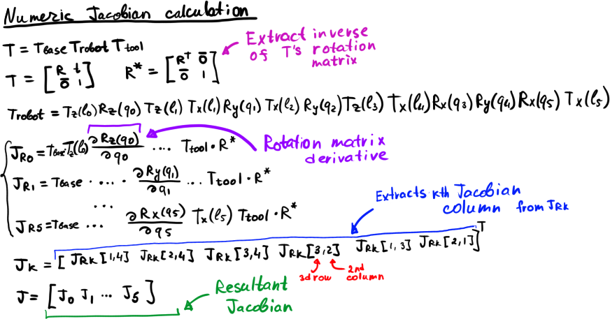
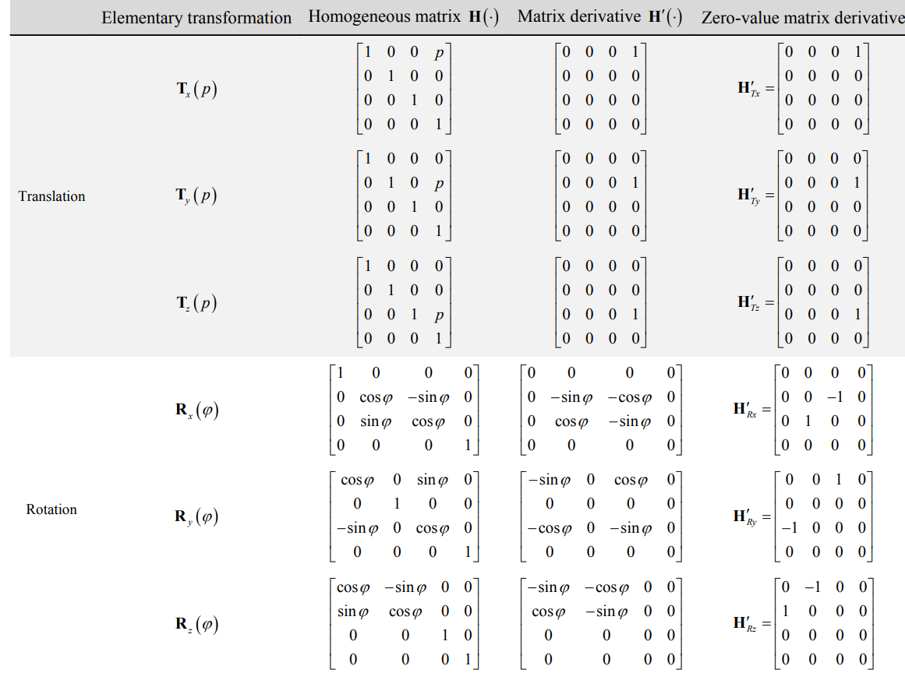
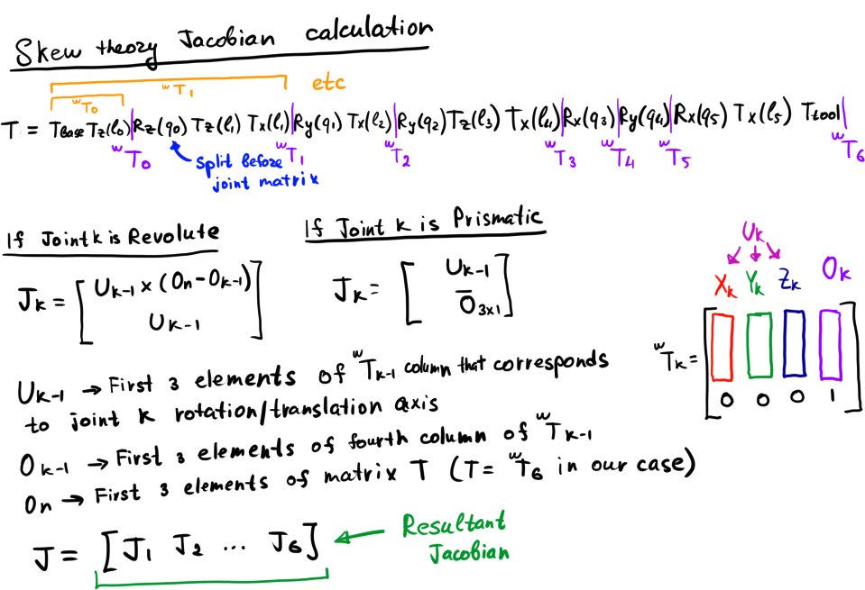
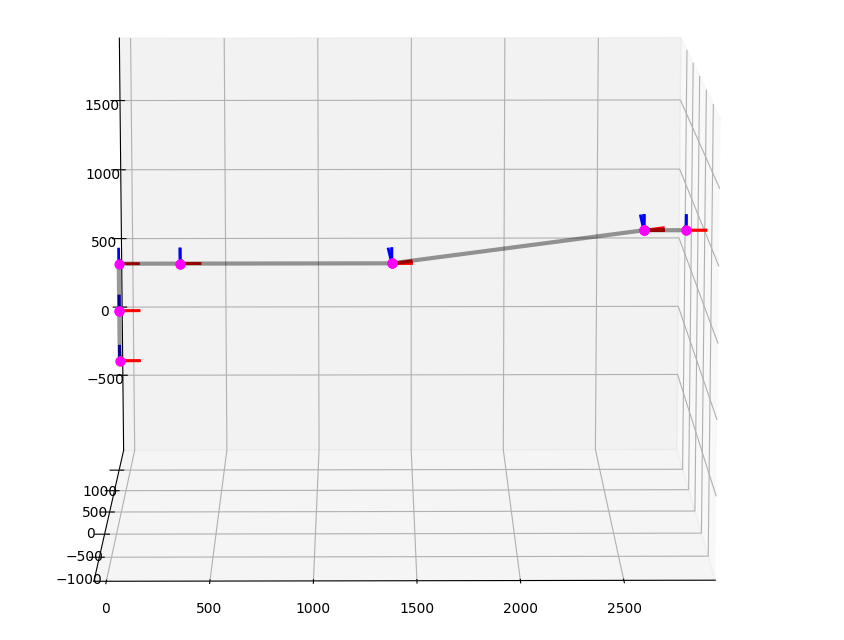
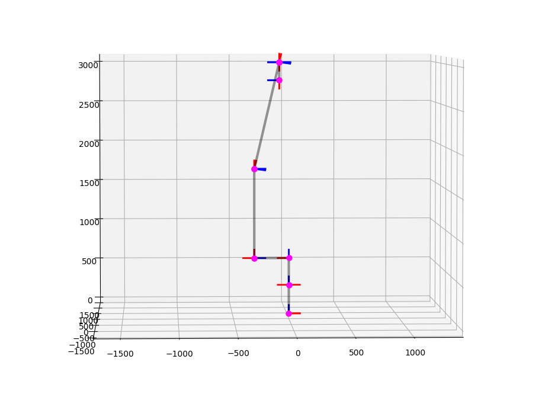
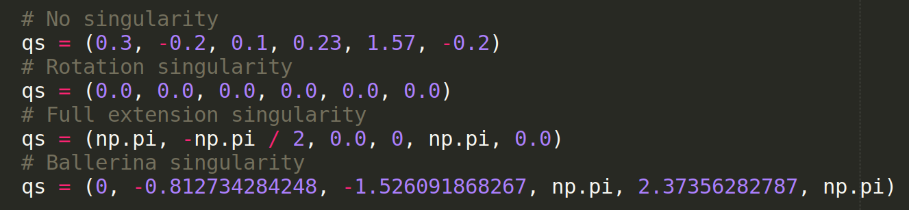

# Jacobian Calculation

The task is to calculate the Jacobian matrix for the **FANUC R-2000iC/165F** manipulator

## Robot Description
We use the following representation of the manipulator:

## Numeric method

The matrix derivatives solution is described here:

And here is a cheatsheet with matrix derivatives, just for reference:

## Skew theory method

The skew theory solution is summarized here:

## Singularity analysis

There are three known possible singularities:

1) Orientation singularity: 

2) "Ballerina" singularity: Tool pose lies on the  rotation axis

3) Full extension singularity: 

And here are possible joint configurations to obtain the singularity cases:

