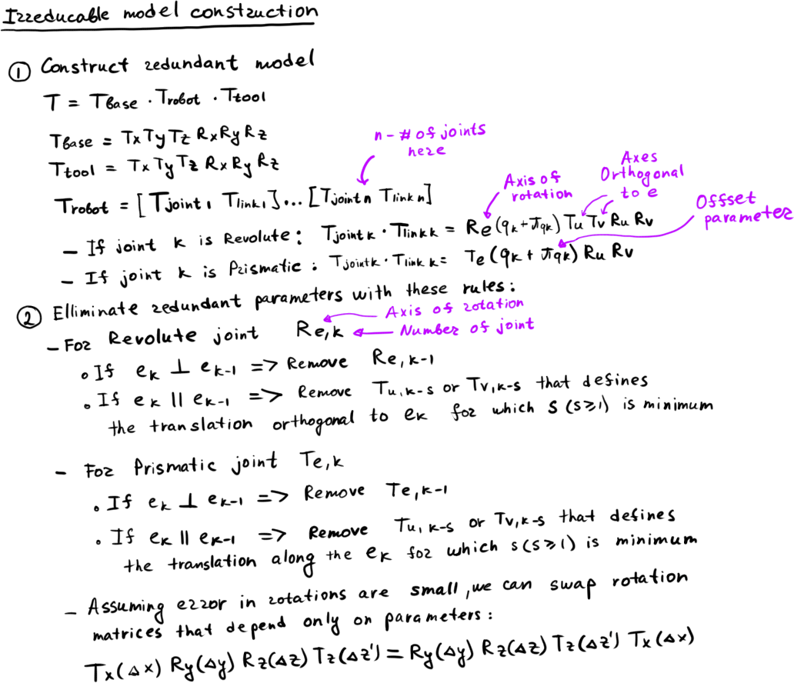
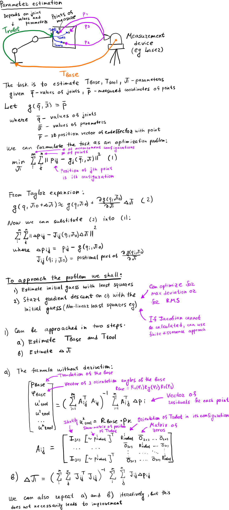
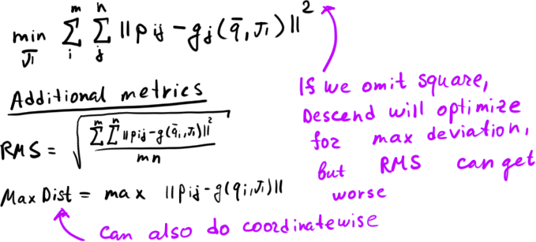

## Geometric calibration

It is very hard, if not impossible, to produce manipulator that exactly matches the datasheet. So, a manipulator has a lot of small errors in link lengths and joint offsets. Accuracy suffers accordingly.

The task is to determine and compensate for those errors to increase positioning accuracy.

We can compare different poses of the manipulator with measurements from more accurate device such as Laser Tracker, and try to minimize the difference.

### Irreducible model creation

The first step is to build a model of the manipulator we are calibrating.
Here is the algorithm:



### Least-squares parameters estimation

The second step is to find the initial guess for parameters (which can also be acceptable as a solution). Here we do this with least-squares approach:



### Gradient descent
If the result on the previous step is not satisfying, we can use Gradient Descent to further minimize the cost function



## Results

Here are the results after one step calibration. To achieve better results, you can try iterating initial guess estimation. This, however, will not always work.

After this, you can do multiple passes with Gradient Descent. This has shown to improve the results. To make the optimization to be faster and more accurate, it is possible to provide Jacobian of the cost function into the least-squares method

### After T_base and T_tool calibration

```
Distance RMS (mm): 13.1540215624739
Max Distance diff (mm): 18.4905680970990

X coordinate RMS (mm): 3.13330198197563
Max X diff (mm): 6.43345048209835

Y coordinate RMS (mm): 7.56315386629134
Max Y diff (mm): 11.6404666757612

Z coordinate RMS (mm): 10.2960869047701
Max Z diff (mm): 14.5188023610010
```

### After parameter calibration
```
Distance RMS (mm): 0.531528594785394
Max Distance diff (mm): 1.32318162735269

X coordinate RMS (mm): 0.318484878395086
Max X diff (mm): 0.970226306057526

Y coordinate RMS (mm): 0.308971955861214
Max Y diff (mm): 0.915702146366357

Z coordinate RMS (mm): 0.292619821268996
Max Z diff (mm): 0.814539644993147
```

### After one step of numerical gradient descent

```
Distance RMS (mm): 0.531498686458444
Max Distance diff (mm): 1.32204701639154

X coordinate RMS (mm): 0.318836990870240
Max X diff (mm): 0.971431910222464

Y coordinate RMS (mm): 0.309310158521645
Max Y diff (mm): 0.916271525768479

Z coordinate RMS (mm): 0.291823667297868
Max Z diff (mm): 0.806988776565049
```