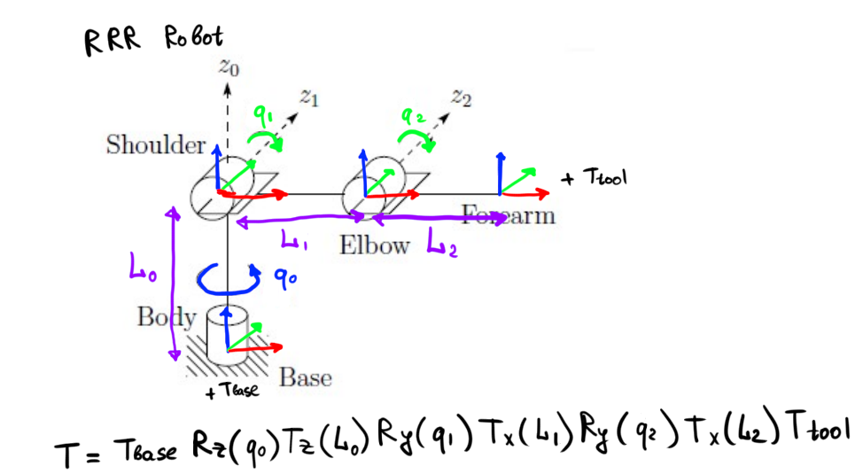
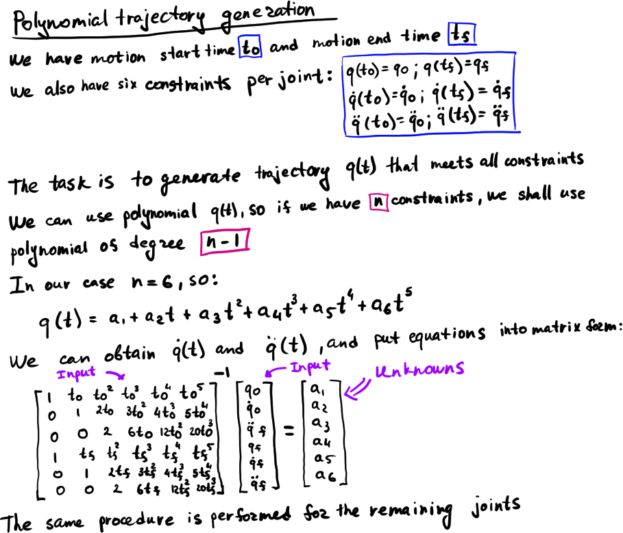
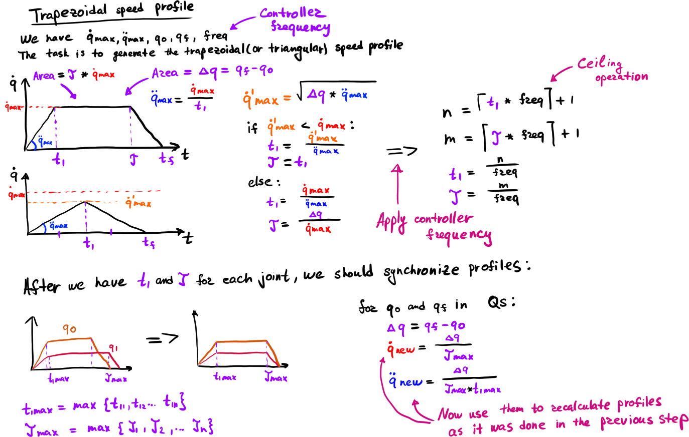
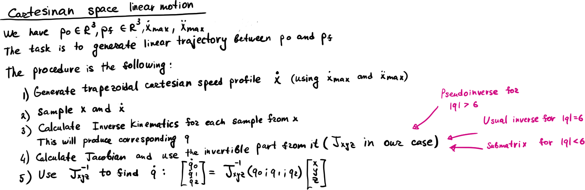

# Trajectory Planning

Here is how the trajectory planning for RRR Robot is done

## Robot description

Robot FK, just in case:

## Polynomial profile

## Trapezoidal profile (Joint Space)

## Trapezoidal profile (Cartesian Space)

