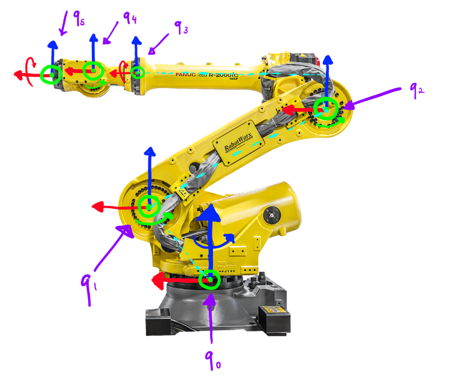
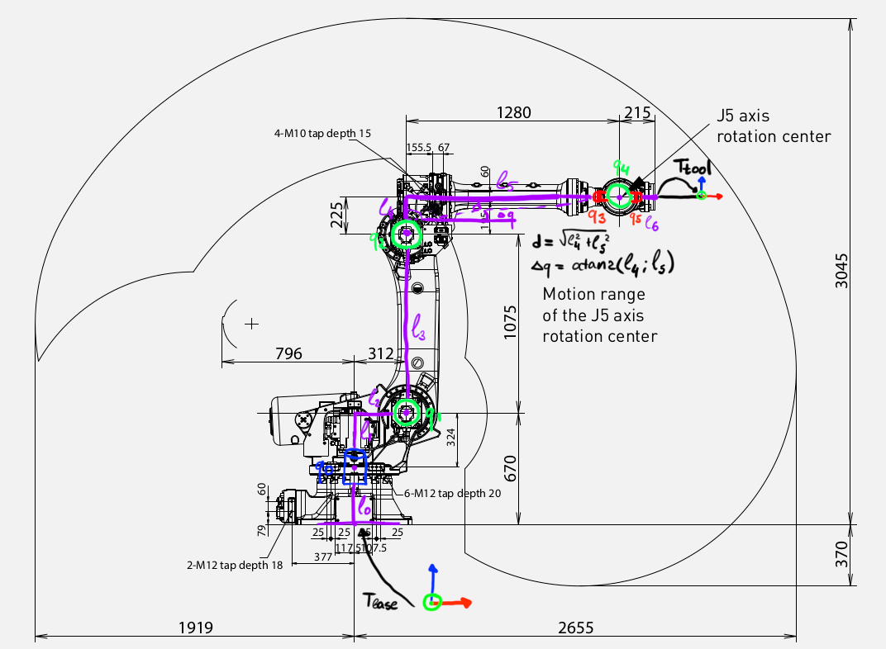
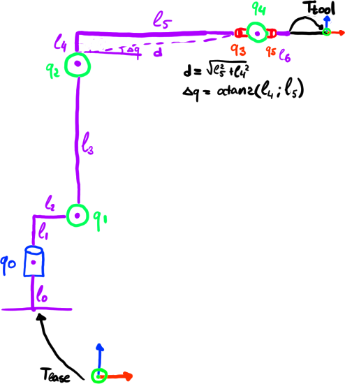
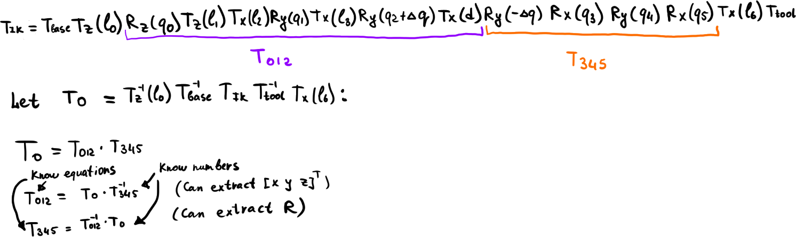
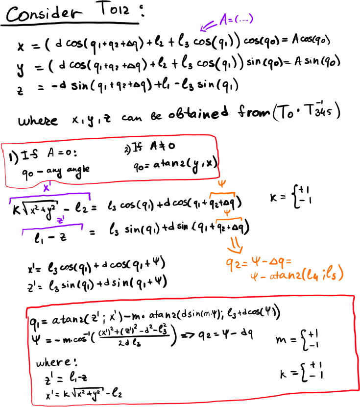
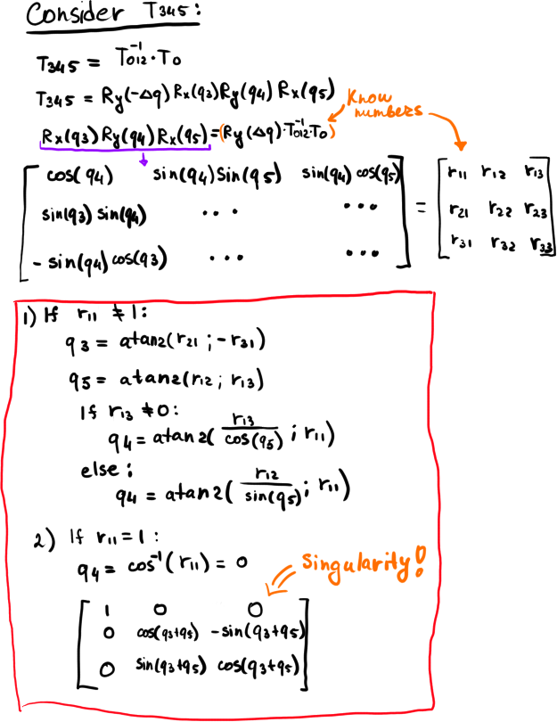

# FANUC R-2000iC/165F Manipulator

Here is the description of how to solve Forward and Inverse Kinematics problems for the manipulator.

## Manipulator Description

The task is to calculate Forward and inverse kinematics for **FANUC R-2000iC/165F**

Here is a diagram of the manipulator:

Here is a scheme with all required dimensions:

And here is a simplified representation:

## Forward kinematics
We are given a joint configuration  and need to obtain corresponding pose of the end effector   in homogeneous form.

The simplified representation makes the derivation of forward kinematics prety straightforward. Just follow the links:

## Inverse kinematics
We are given a pose  and need to find all link configurations  that can move effector to pose 

We shall use the Pieper’s method for that:

Let us consider position first:

Now, for the rotation:

